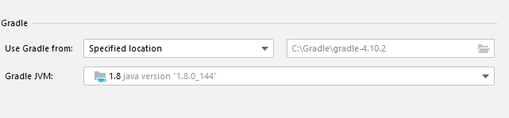
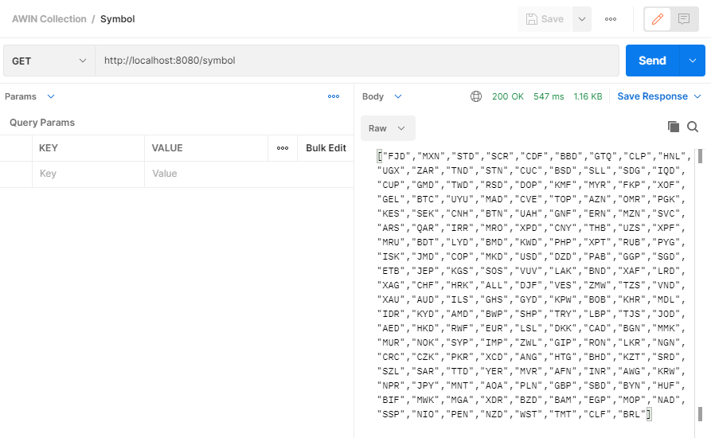
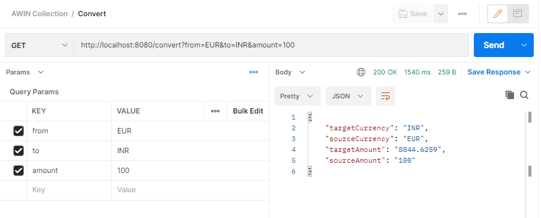
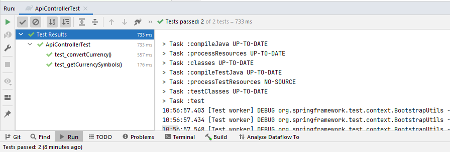

# Currency Converter

Build a small helper app to perform currency exchange rate conversions. Create a concept for a currency conversion solution app that will input the source and target currency, enter an amount and trigger the conversion from source to target. The app will display the conversion and a list of current currency rates for the selected source currency.

For getting the conversion rates, assume you would use this service: https://exchangerate.host/

# Solution

## Prerequisite
1. JAVA 1.8.x should be installed
2. <a href="https://gradle.org/releases/">Gradle 4.10.x</a> should be installed


## Partner API Settings
For api service for currency exchange https://exchangerate.host/ and implement the solution. 

Update partner api configuration in `src\main\resources\application.properties`

```
currency.baseUrl=https://api.exchangerate.host/
currency.path.symbol=latest
currency.path.convert=convert
currency.accesssKey=API_Key
```
## Project Execute/Run
Now run `gradle bootRun` in termial. It will run the server endpoint api in http://localhost:8080. Keep this running.

```
gradle bootRun
```

### API Endpoints:
1. GET http://localhost:8080/symbol

2. GET http://localhost:8080/convert?from=EUR&to=INR&amount=www



## Project Unit Test
Used JUnit for the unit testing. Wrote 2 unit testcases.

